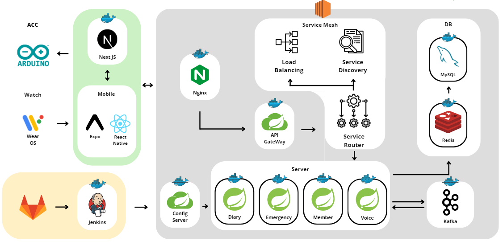

# 🌞 따 숨

## 1️⃣ 프로젝트 개요

### 🎈 **기획 배경**

### 🎈 **프로젝트 목표**

### 🎈 **개발 기간**

| 개발기간 | 2024.10.14 ~ 2024.11.19 (6주) |

### 🎈 **팀원 소개**

| Contributors | Role | Position |
| ------------ | ---- | -------- |
| 손다인       | 팀장 | - BE     |
| 　박지훈     | 팀원 | - BE     |
| 　김두열     | 팀원 | - BE     |
| 　김신범     | 팀원 | - BE     |
| 　김민영     | 팀원 | - FE     |
| 　강창우     | 팀원 | - FE     |
| 　서민수     | 팀원 | - FE     |

---

## 2️⃣ 서비스 기능 소개

### 🎈 **워치**

---

### 🎈 **앱**

---

### 🎈 **블루투스 키링**

---

## 3️⃣ 프로젝트 설계

### 🎈 **기술 스택**

FE: Next.js, Expo, tailwind, react query, redux toolkit

BE: Java 17, SpringBoot 3.x.x, Kafka

DB: MySQL, Redis

Infra: Ubuntu, Docker

  <h3>AI</h3>
  

   
  
  
  

  <h3>Frontend</h3>
  

  
  
  
  

  
  
  
  
  
  

  <h3>Backend</h3>
  

  
  
    
  <!--  
   -->
  

  <h3>Database</h3>
  

  
  
    
  

  <h3>Infra</h3>
  

   
   
   
  
   

  <h3>협업 툴</h3>
  

  
  
   
  
  

 

### 🎈 **아키텍처**

 

## 4️⃣ Git Commit Convention

### 🎈 **1. 타입**

- `FEAT`: 새로운 기능 추가(API 스펙 변경)
- `FIX`: 버그 수정
- `DEL`: 사용하지 않는 파일, 코드 삭제
- `DOCS`: 문서 수정
- `STYLE`: 코드 스타일 변경(white-space, formatting, missing semi-colons, etc)
- `REFACTOR`: 코드 리팩토링(기능 변경x) -> 객체 책임 분리, 구조변경
- `TEST`: 테스트 코드 추가
- `CHORE`: 빌드 업무 수정, 패키지 매니저 수정 (.gitignore 수정 등)
- `DESIGN`: UI 스타일 변경
- `REVERT`: 이전 커밋으로 되돌리기
- `RENAME`: 파일명 또는 폴더명 변경 및 이동

### 🎈 **2. 커밋 메시지 형식**

- `[타입] #{이슈 번호} 커밋 메시지`
  - ex) `[FEAT] #17 유저 엔티티 추가`

### 🎈 **3. 작성 시 유의점**

- 제목 끝에 마침표 붙이지 않기
- “어떻게” 보다는 “무엇, 왜”를 중심으로 작성하기
- 본문 작성이 필요한 경우 제목과 빈 행을 한 줄 띄어 구분

### 🎈 **4. 브랜치 네이밍**

- `feature/#{이슈 번호}`
- ex) `feature/#15`
- 무조건 브랜치 이름은 `feature/#{이슈 번호}` 로
  - 디자인, 리팩토링, 버그 픽스 등은 git lab issue에 Labels를 이용해서 표기
  - 이슈 이름에 리팩토링, 버그 픽스, 디자인 등을 명시
    - ex) 여행 계좌 생성 기능 리팩토링
    - ex) 여행 계좌 ui 디자인

### 🎈 **5. Merge Request 네이밍**

- 제목: `#{이슈 번호} {이슈 제목}`
- ex) `#15 유저 엔티티 생성`
- 본문에 `close #{이슈 번호}` 입력
  - merge 시 issue 자동으로 닫힘
