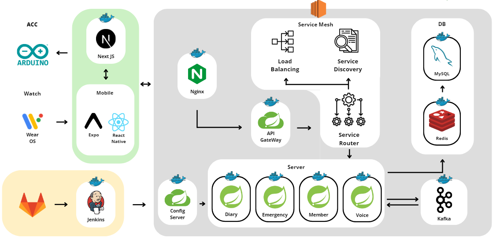

# 🌞 따숨

  

## 프로젝트 개요

### 기획 배경

공황장애 진단 인원이 빠르게 증가하면서, 일상에서 불안을 관리할 수 있는 실질적인 도구의 필요성이 커졌습니다.
따숨은 공황 발작을 미리 감지하고, 발작 순간과 평소 훈련을 함께 지원하는 서비스를 목표로 기획되었습니다.

### 프로젝트 목표

갤럭시 워치로 수집한 심박수 데이터를 기반으로 공황 발작을 예측하고,
발작 기록·자가진단·생활습관 데이터를 리포트로 제공해 사용자가 자신의 상태를 객관적으로 파악할 수 있도록 돕습니다.

### 개발 기간

| 항목      | 기간                          |
| --------- | ----------------------------- |
| 개발 기간 | 2024.10.14 ~ 2024.11.19 (5주) |

### 팀원 소개

| 구분 | 이름   | 역할 | 포지션  | 담당                                       |
| ---- | ------ | ---- | ------- | ------------------------------------------ |
| FE   | [강창우](https://github.com/monam2) | 팀원 | FE, App | 워치, 아두이노                             |
| FE   | [김민영](https://github.com/minyeong981) | 팀원 | FE, Web | 캘린더, 비상연락처, 리포트                 |
| FE   | [서민수](https://github.com/seomsoo) | 팀원 | FE, Web | 훈련, 게이미피케이션, 설정페이지, 자가진단 |
| BE   | [김두열](https://github.com/enduf7686) | 팀원 | BE      | -                                          |
| BE   | [김신범](https://github.com/ShinBeomKim) | 팀원 | BE      | -                                          |
| BE   | [박지훈](https://github.com/JiHunparkkk) | 팀원 | BE      | -                                          |
| BE   | [손다인](https://github.com/dain0826) | 팀장 | BE      | -                                          |

## 서비스 기능 소개

### 워치

#### 실시간 심박수 측정

  

#### 긴급 상황 대응

<table align="center">
  <tr>
    <td align="center"></td>
    <td align="center"></td>
  </tr>
</table>

#### 호흡 가이드

  

### 앱

#### 카카오 로그인

  

#### 따소미 상호작용

<table align="center">
  <tr>
    <td align="center"></td>
    <td align="center"></td>
    <td align="center"></td>
  </tr>
</table>

#### 긴급 상황

<table align="center">
  <tr>
    <td align="center"></td>
    <td align="center"></td>
    <td align="center"></td>
  </tr>
</table>

#### AI 보이스 녹음

<table align="center">
  <tr>
    <td align="center"></td>
    <td align="center"></td>
  </tr>
</table>

#### 비상연락처 저장

  

#### 호흡하기 연습

<table align="center">
  <tr>
    <td align="center"></td>
    <td align="center"></td>
    <td align="center"></td>
  </tr>
</table>

#### 그라운딩 훈련

  

#### 안정화 기법

<table align="center">
  <tr>
    <td align="center"></td>
    <td align="center"></td>
    <td align="center"></td>
  </tr>
  <tr>
    <td align="center"></td>
    <td align="center"></td>
    <td></td>
  </tr>
</table>

#### 캘린더 (생활 습관 기록)

  

#### 자가진단

<table align="center">
  <tr>
    <td align="center"></td>
    <td align="center"></td>
    <td align="center"></td>
  </tr>
  <tr>
    <td align="center"></td>
    <td></td>
    <td></td>
  </tr>
</table>

#### 생활 리포트

<table align="center">
  <tr>
    <td align="center"></td>
    <td align="center"></td>
    <td align="center"></td>
  </tr>
</table>

### 블루투스 키링

#### 비닐봉지 내장 호흡 보조도구

<table align="center">
  <tr>
    <td align="center"></td>
    <td align="center"></td>
  </tr>
</table>

#### 손난로 기능

  

## 프로젝트 설계

### 기술 스택

#### AI

  
  
  

#### Frontend

  
  
  
  
  
  
  
  

#### Backend

  
  
  

#### Database

  
  
  

#### Infra

  
  
  
  

#### 협업 툴

  
  
  
  

## 아키텍처

  

## 아두이노

  

